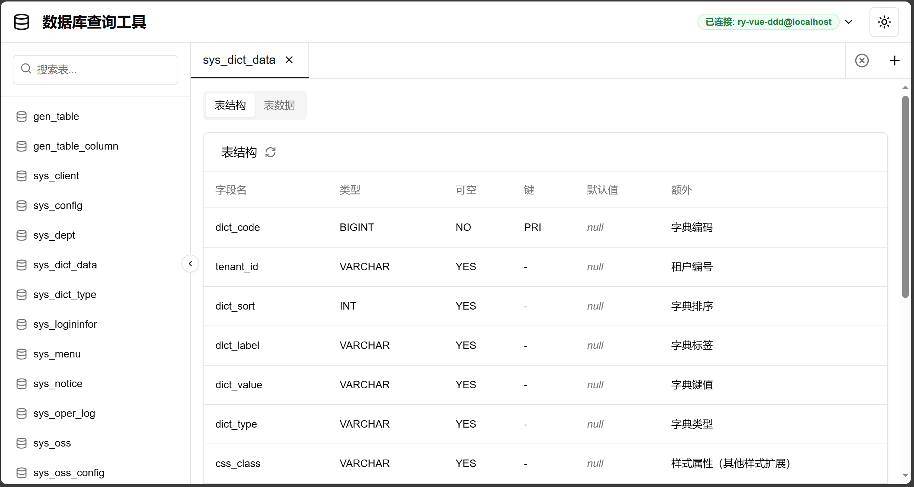
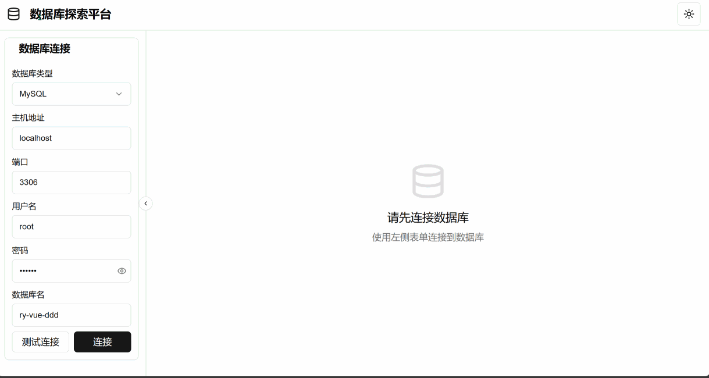

# Database Explorer Platform

[](https://github.com/mynxg/db-explorer/stargazers)
[](https://github.com/mynxg/db-explorer/issues)
[](https://github.com/mynxg/db-explorer/issues?q=is%3Aissue+is%3Aclosed)
[](https://github.com/mynxg/db-explorer/pulls)
[](https://github.com/mynxg/db-explorer/pulls?q=is%3Apr+is%3Aclosed)

[简体中文](README.md) | English

An intelligent database query and exploration tool that supports dynamic connections to MySQL and Oracle databases, enabling visualization of table structures and data for querying and analysis.





## Features

- Support for multiple database types (MySQL, PostgreSQL, Oracle, SQL Server)
- Table structure viewing
- Paginated table data browsing
- SQL query execution

## Tech Stack

- Spring Boot
- JDBC (MySQL Connector/J and Oracle OJDBC)
- HikariCP connection pool
- RESTful API interface

## Installation and Running

### Prerequisites

- JDK 1.8
- Maven

### Installation Steps

1. Clone the repository

```bash
git clone git@github.com:mynxg/db-explorer.git
```


2. Run the project

Open the project in IntelliJ IDEA and run it

3. API address

[http://localhost:8076/api](http://localhost:8076/api)

## Frontend Project:

Web application: [db-explorer-web](https://github.com/mynxg/db-explorer-web)



## Contributing

Contributions of code, issue reports, or improvement suggestions are welcome!

## License

This project is licensed under the MIT License - see the [LICENSE](LICENSE) file for details

## Star History

[](https://star-history.com/#mynxg/db-explorer&Date)