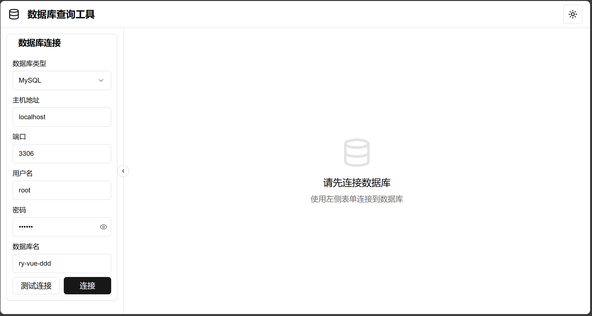
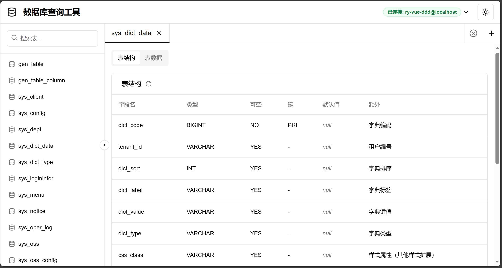
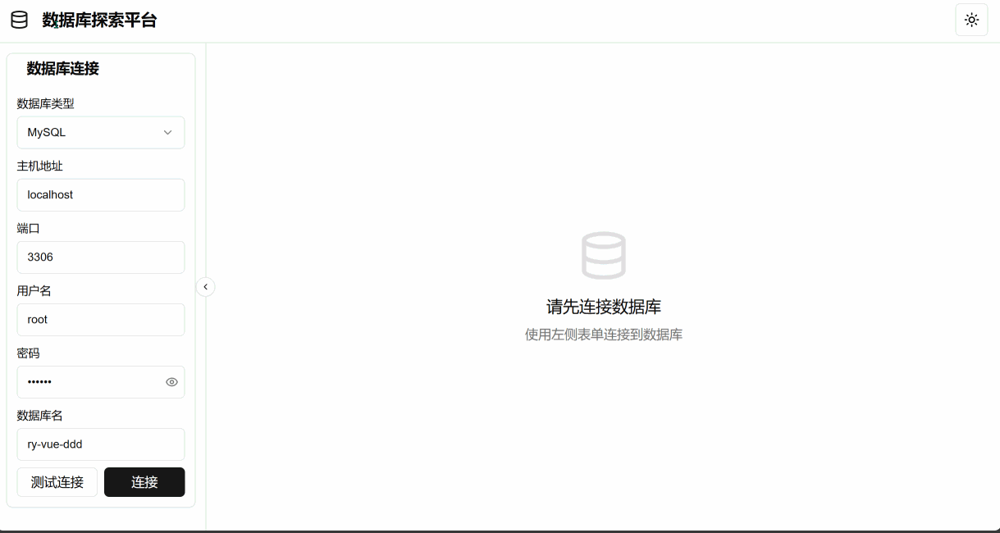

# 数据库探索平台

[](https://github.com/mynxg/db-explorer/stargazers)
[](https://github.com/mynxg/db-explorer/issues)
[](https://github.com/mynxg/db-explorer/issues?q=is%3Aissue+is%3Aclosed)
[](https://github.com/mynxg/db-explorer/pulls)
[](https://github.com/mynxg/db-explorer/pulls?q=is%3Apr+is%3Aclosed)


简体中文 | [English](README-EN.md)


一个智能化的数据库查询与探索工具，支持动态连接MySQL和Oracle数据库，实现表结构和数据的可视化查询与分析。






## 功能特点

- 支持多种数据库类型（MySQL, PostgreSQL, Oracle, SQL Server）
- 表结构查看
- 表数据分页浏览
- SQL 查询执行


## 技术栈

- Spring Boot
- JDBC (MySQL Connector/J 和 Oracle OJDBC)
- HikariCP 连接池
- RESTful API 接口        


## 安装与运行

### 前提条件

- jdk1.8
- maven


### 安装步骤

1. 克隆仓库

```bash
git clone git@github.com:mynxg/db-explorer.git
```

2. 运行项目

Idea打开项目，运行项目


3. 接口地址

[http://localhost:8076/api](http://localhost:8076/api)


## 前端项目：

web应用：[db-explorer-web](https://github.com/mynxg/db-explorer-web)

效果：



## 贡献

欢迎贡献代码、报告问题或提出改进建议！


## 许可证

本项目采用 MIT 许可证 - 详情请参阅 [LICENSE](LICENSE) 文件

## Star History

[](https://star-history.com/#mynxg/db-explorer&Date)

